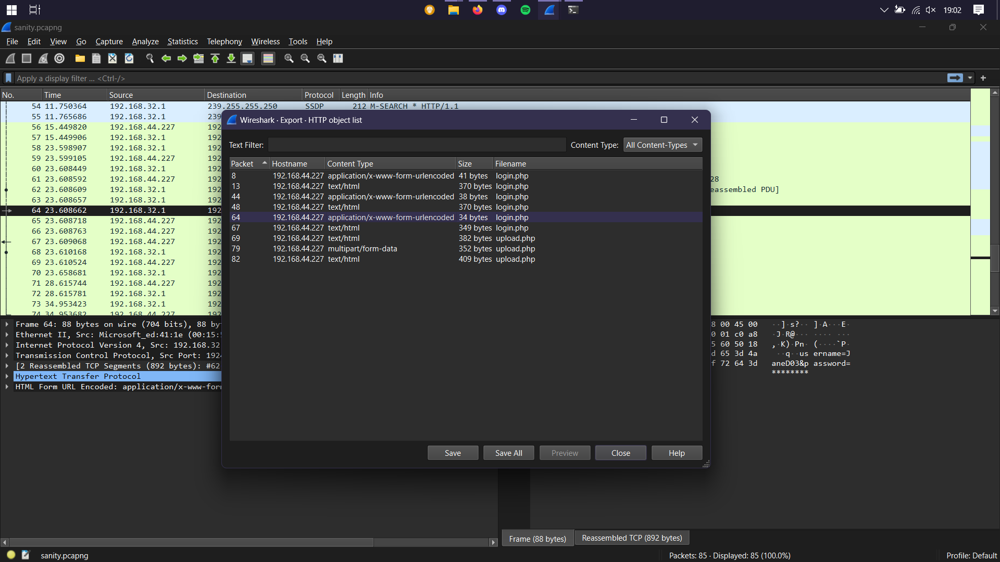
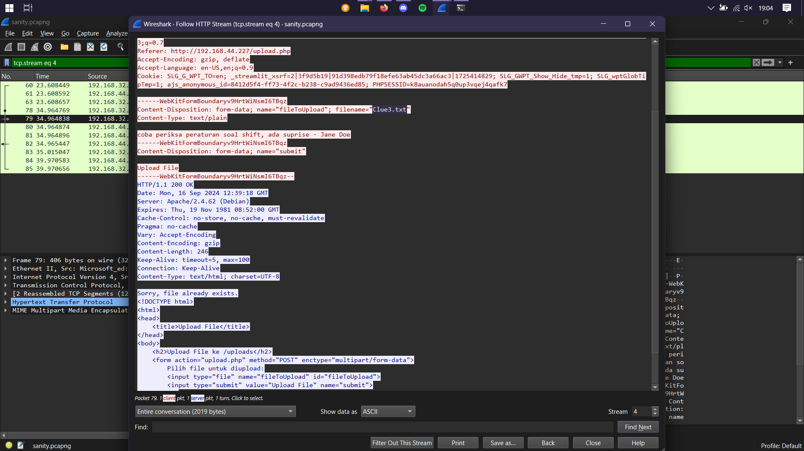
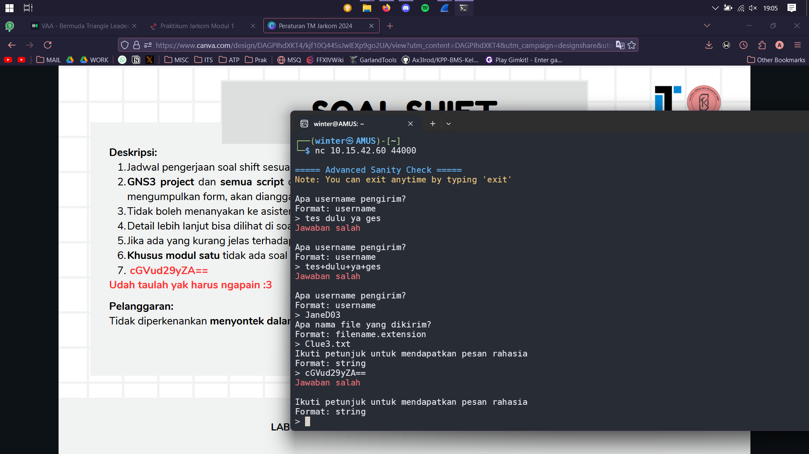
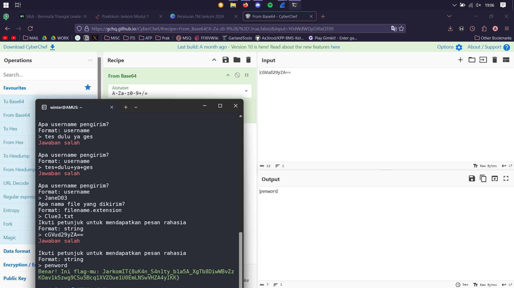
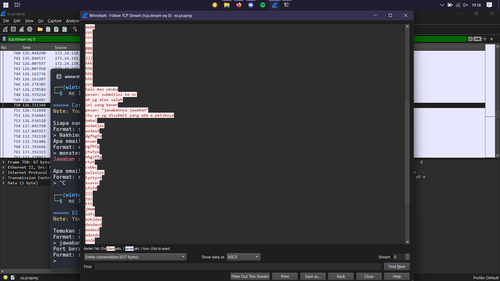
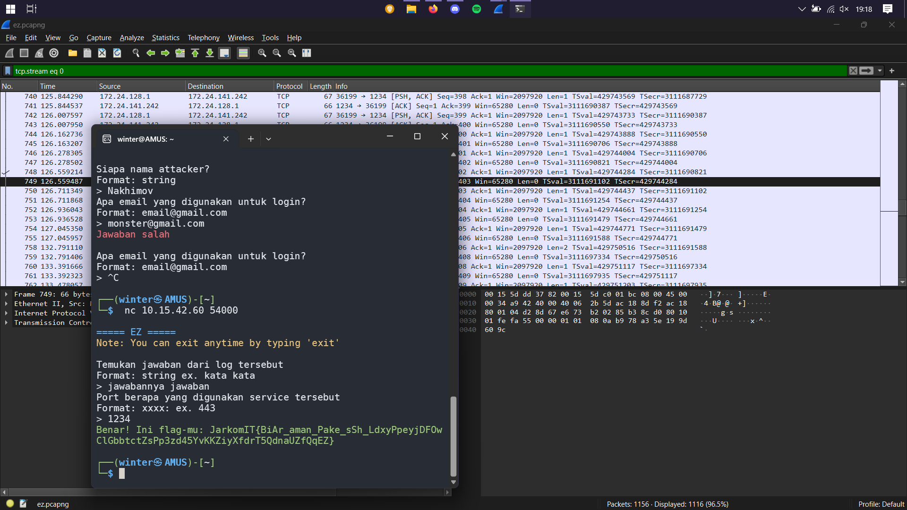

# Jarkom-1-2024-IT24

* nama
* nama

## Advance Sanity Check

1. Mendapat username dari HTTP export objects

2. Disuruh buka Peraturan Praktikum lalu mendapat string

3. Saya melihat pola "==" di ujung string dan langsung memikirkan Base64 decode

## EZ

1. Melihat stream terlihat ada string yang menunjukkan jawaban dan saya mengecek port asal dari string tersebut